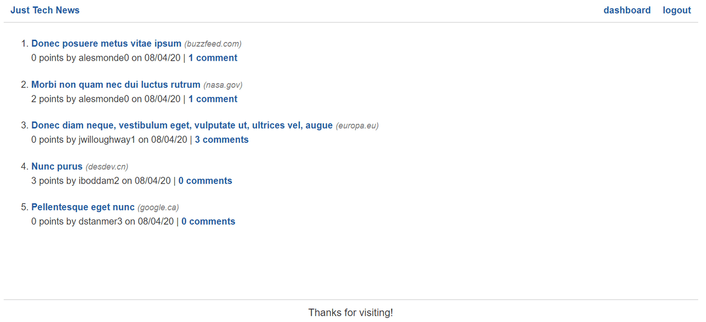

<!-- ## README

This file contains information about the project, including how to install and use it.

### Installation

To install the project, follow these steps:

1. Clone the repository to your local machine.
2. Install the necessary dependencies using `npm install`.
3. Start the application using `npm start`.

### Usage

To use the application, follow these steps:

1. Open the application in your web browser.
2. Enter your search query in the search bar.
3. Press the search button to retrieve results.

### Contributing

To contribute to the project, follow these steps:

1. Fork the repository.
2. Create a new branch for your changes.
3. Make your changes and commit them.
4. Push your changes to your fork.
5. Submit a pull request to the original repository.

### License

This project is licensed under the MIT License. See the `LICENSE` file for more information.
** -->


# AJ's Notes


## Lesson 1: Set up the Flask App


- Site Preview:




## Acceptance Criteria
**Title:** Set up app to render templates

**User Stories**

* As a user, I want to be able to view the home and dashboard pages in the browser
  

**Title:** Set up database and models

**User Stories**

* As a user, I need a database that can store my account, posts, comments, or upvotes
* 
  
**Title:** Finalize homepage views with data and filters

**User Stories**

* As a user, I want to be able to see my posts on the homepage

* I expect to see dates, URLs, and plural words properly formatted

**Title:** Implement user logins and sessions

**User Stories**

* As a user, I want to be able to log in and have my session remembered if I refresh the page


**Title:** Build and safeguard remaining routes

**User Stories**

* As a logged-in user, I want to be able to create new posts and comments and upvote other posts


**Title:** Deploy the app

**User Stories**

* As a user, I want to be able to visit the app on a public URL

---

## Virtual Env

```bash

python -m venv venv
source venv/bin/activate

```

---

- Flask
- Flask is a microframework for Python
- Flask is used to build web apps

- Flask has templating builtin with Jinja2
- example:


```
<ol>


<li>
    <a href="{{post.post_url}}">{{post.title}}</a>
</li>

</ol>

```


---

## Lesson 2: 
- Set up the database

- SQLAlchemy is a Python library for working with databases
- SQLAlchemy is an ORM (Object Relational Mapper)

```bash
mysql -u root -p
```

```sql
CREATE DATABASE python_news_db;
```